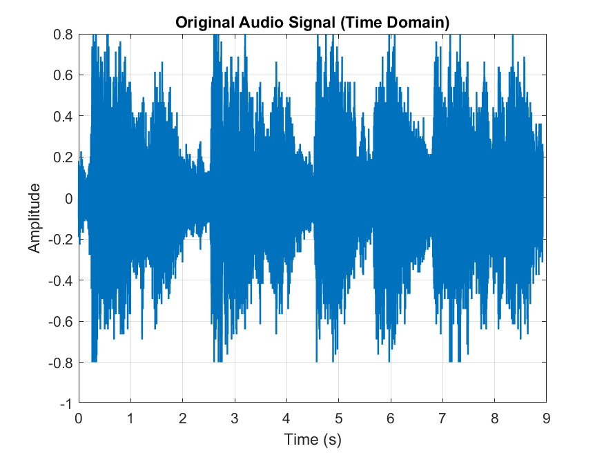
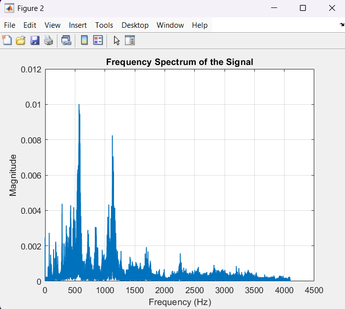
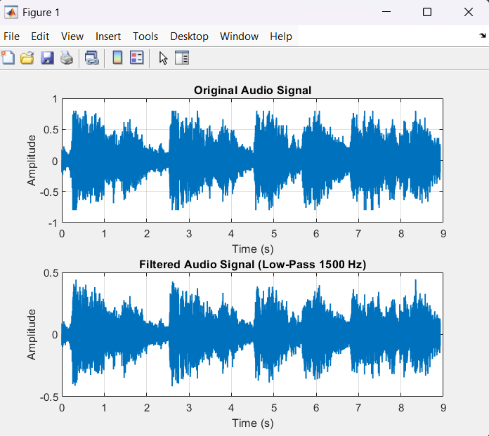

# 🎧 Audio Signal Processing with FFT (MATLAB)

This project demonstrates **audio signal analysis and noise filtering** using  
**Fast Fourier Transform (FFT)** in MATLAB.  
The workflow includes loading an audio signal, transforming it into the frequency domain,  
applying a low-pass filter, and reconstructing the cleaned signal.

---

### 📁 Project Structure

```
Audio-Signal-Processing-FFT/
├── audio/        → Original & filtered audio (.wav)
├── results/      → Exported figures (.png)
├── src/          → MATLAB source code (main.m)
└── README.md
```

---

## 🔍 1. Load Audio Signal & Time Domain Visualization

The original MATLAB sample audio (`handel.mat`) is converted to `.wav`  
and plotted in the time domain.

---

## 🔊 2. FFT: Frequency Spectrum Analysis

The project performs **Fast Fourier Transform** to analyze  
the frequency components of the signal.

---

## 🎚️ 3. Low-Pass Filter (1500 Hz)

A custom low-pass filter is applied in the frequency domain  
to reduce high-frequency noise.

---

## 🔄 4. Inverse FFT & Comparison

The filtered signal is transformed back into the time domain  
and compared with the original audio.

---

## 📊 Results

### **Original Audio Signal**
<p align="center">
  
</p>

### **Frequency Spectrum**
<p align="center">
  
</p>

### **Filtered Audio Signal**
<p align="center">
  
</p>

---

## ▶️ Running the Project

1. Open `src/main.m` in MATLAB  
2. Run the script  
3. Output audio files and plots are saved automatically

---

## 📌 Used Technologies

- **MATLAB R2024a**
- FFT (Fast Fourier Transform)
- Digital Signal Processing
- Frequency-domain filtering

---

## 👩‍💻 Author

**Hatice Sude**  
📧 Email: [haticesudemutlu@gmail.com](mailto:haticesudemutlu@gmail.com)  
🔗 LinkedIn: [linkedin.com/in/haticesudemutlu344](https://www.linkedin.com/in/haticesudemutlu344)

---

## 📜 License

This project is licensed under the MIT License.

